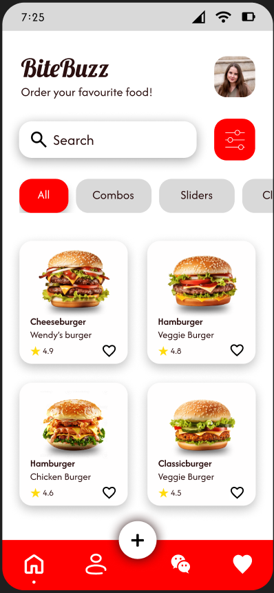
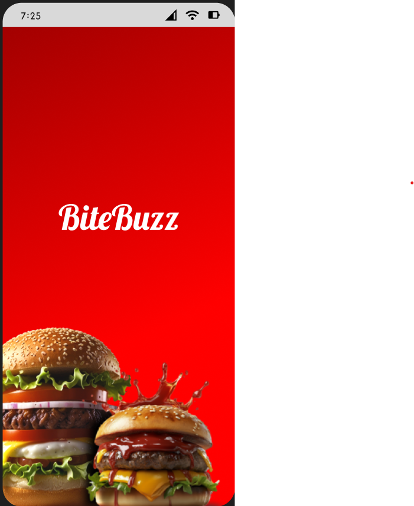
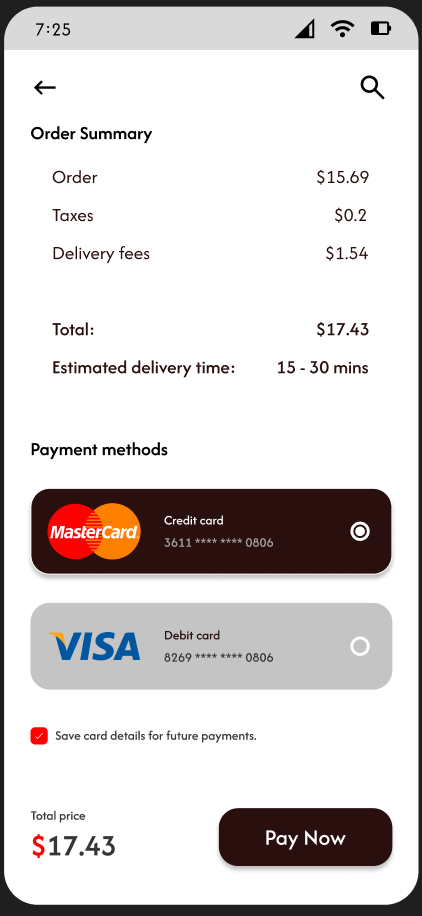

# 🍔 BiteBuzz – Food Delivery App UI

**BiteBuzz** is a colorful, user-friendly food delivery app UI crafted to simplify the food ordering experience. Designed with a focus on clarity, smooth navigation, and visual appeal, it caters to modern users who value speed, simplicity, and style.

🔗 **Live Figma Prototype**: [View on Figma](https://www.figma.com/proto/Beppm6EBtV3vroDNZXUrdP/Untitled?node-id=0-1&t=yHsMFUIXSgW9y5ik-1)

---

## 🚀 Features

- 📱 Clean and responsive mobile layout
- 🔍 Smart search and category filters
- 🍕 Food listing with clear visuals and pricing
- 🛒 Cart and checkout flow designed for ease of use
- ⭐ Ratings, delivery time, and discounts highlighted clearly
- 🎨 Light theme with a bright, appetizing color palette

---

## 🖼️ Preview

| Home Screen | Splash Screen | Checkout Screen |
|-------------|---------------|------------------|
|  |  |  |

---

## 🛠️ Tools Used

- **Figma** – UI Design & Prototyping  
- **Canva** – Icon assets and visual elements  
- **Illustrator** – Logo and branding elements  

---

## 💡 Design Goal

The goal behind BiteBuzz was to create an intuitive and visually rich experience that not only makes food discovery fun but also ensures a frictionless ordering journey from browse to checkout.

---

## 👩‍💻 Designer

**Khushi Patel**  
UI/UX Designer | IT Engineering Student  
📫 khushipatel200411@gmail.com  
🔗 [LinkedIn](https://www.linkedin.com/in/khushi-patel-279567338) | [Instagram](https://instagram.com/justtkhushii_._)

---

